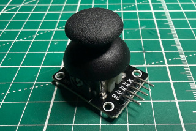

# Library for joystick KY023

This is a simple library for the classical KY023 joystick module for Arduino
boards and compatibles. It just wraps the analog reads in a tidy class and maps
the X and Y values in the -1.0 to 1.0 range.

